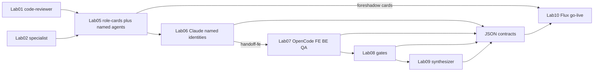

# Multi-Agent Identity Plan (สมดุล → Lab 10 go-live)

**สถานะ:** blueprint สำหรับรอบ implement ถัดไป  
**ขอบเขตรอบเอกสารนี้:** กำหนดหลักการ สเปก starter เกณฑ์ผ่าน และ checklist — **ยังไม่** สร้างไฟล์ใน `shared/agent-starters/` หรือแก้ Lab README จนกว่าจะมีรอบ implement ตามหมวด 8

อ้างอิง:

- [`LAB-ARCHITECTURE.md`](LAB-ARCHITECTURE.md)
- [`../shared/research/MULTI-AGENT-LAB-DESIGN-BRIEF.md`](../shared/research/MULTI-AGENT-LAB-DESIGN-BRIEF.md)
- [`../labs/lab-10-kanban-collab/README.md`](../labs/lab-10-kanban-collab/README.md)
- [`../AGENTS.md`](../AGENTS.md)

---

## 1) ปัญหาปัจจุบัน

คอร์สเน้น **multi-agent** แต่ในเครื่องมือมี agent definition จริงแค่สองไฟล์:

| โฟลเดอร์ | ไฟล์ที่มี | Lab |
|---|---|---|
| `.claude/agents/` | `code-reviewer.md` | 01 |
| `.opencode/agents/` | `specialist.md` | 02 |

บทบาท Frontend / Backend / QA / Synthesizer อยู่ใน [`AGENTS.md`](../AGENTS.md) และสัญญา `role-cards.json` แต่ Lab 06–07 มักรันด้วย **สลับหมวกใน prompt** (โดยเฉพาะ OpenCode ที่ใช้ `--agent specialist` คนละรอบ)

ผลที่ตามมา:

- ผู้เรียนมองเห็น “ทีม” น้อย — รู้สึกเหมือน single-agent สลับบทบาท
- context window กองในแชทเดียวง่าย
- ตอน Lab 10 go-live การ์ด Flux มี `assignee_role` แต่ไม่มี **ชื่อ agent ที่เรียกซ้ำได้** → เสี่ยงเลื่อนการ์ดแบบ POC โดยไม่ลงมือด้วย identity จริง

**จุดจบของสายนี้ไม่ใช่ Lab 07** — named agents + สัญญาต้องส่งต่อไป Lab 10 แล้วรัน loop go-live ได้จริง

---

## 2) เป้าหมายการสอน

1. **Multi-agent ที่มองเห็น** — มีตัวตน agent คนละไฟล์ / คนละชื่อคำสั่ง
2. **JSON ยังเป็นแกน** — ownership, handoff, ด่าน, ship อยู่ใน `workspace/contracts/`
3. **Lab 10 go-live ได้จริง** — บอร์ดสด + มอบหมายชัด + งานตาม ownership + เลื่อนการ์ดหลังงานเสร็จ (ไม่ใช่สาธิต MCP / สร้างการ์ดเพื่องานนับ)
4. **Context สะอาด** — คนละ agent / คนละรอบรองรับการเปิดงานทีละการ์ดบน Flux

---

## 3) หลักการ / non-goals

### หลักการที่ล็อก



1. **Lab 01–02 คงเดิม** — starter `code-reviewer` และ `specialist` ไม่ย้ายบทเรียน
2. **Lab 05 = จุดแตกทีมที่มองเห็น** — นอกจาก `role-cards.json` ผู้เรียนคัดลอก + ปรับ agent identity คนละไฟล์จาก template และ foreshadow การ์ด Flux ให้ผูก **บทบาท + ชื่อ agent + เครื่องมือ**
3. **Lab 06–07 บังคับ named agents** — ห้ามผ่านด้วยการสลับหมวกบน `specialist` / แชทเดียวเป็นหลัก
4. **สัญญา JSON = แหล่งความจริง** — agent file = ตัวตน + สิทธิ์สั้น ๆ; ไม่ duplicate กฎยาวทั้งคอร์ส
5. **Teams ไม่ใช่ทางเดียวที่ผ่าน** — Subagents + named agents ยังผ่าน
6. **Lab 10 = climax go-live** — การ์ด FE/BE/QA แมป 1:1 กับ named agents จาก Lab 05; ลงมือด้วย agent ชื่อนั้น → อัปเดต JSON → ค่อยเลื่อนการ์ด

### Non-goals / anti-goals

- ไม่บังคับ Agent Teams เป็นทางเดียวที่ผ่าน Lab 06
- ไม่บังคับ OpenCode plugin เป็นทางเดียวที่ผ่าน Lab 07 (ลำดับมือยังผ่าน)
- ไม่ให้ synthesizer เป็นใบ WIP ที่ 4 บน Flux
- **Lab 10 ห้าม:** สร้างการ์ดเพื่องานนับ; เลื่อนการ์ดโดยไม่เรียก named agent ทำงาน; ใช้ `specialist` สลับหมวกปิดทั้ง 3 การ์ดแล้วเคลม multi-agent go-live; ผ่านด้วย `kanban-snapshot.json` โดยไม่มีบอร์ดสด; ใช้การ์ดแทน `handoff-*.json` / `audit-result`

### Context / ต้นทุน

- คนละ agent / คนละรอบ = context สะอาด และรองรับ Lab 10 ที่เปิดงานทีละการ์ด
- `specialist` คงไว้เพื่อ Lab 02 (เทียบเครื่องมือ) และ fallback เมื่อ named agent โหลดไม่ขึ้น — **ไม่**นับเป็นเกณฑ์ผ่าน Lab 07 หรือ Lab 10
- จำกัดทีม ≤ 3–4 ตามของเดิม; synthesizer ไม่เข้าทีม Lab 06

---

## 4) บันได Lab 01→10 (agent identity + การส่งต่อ)

| Lab | Identity | ส่งต่อไป |
|---|---|---|
| 01 | สร้าง/ใช้ `code-reviewer` | สัญญา `code-review.json` |
| 02 | สร้าง/ใช้ `specialist` | ตารางเทียบใน learning-log |
| 03–04 | ไม่สร้าง agent ใหม่ (สิทธิ์ / memory) | ตั้งค่าเครื่องพร้อมทีม |
| 05 | คัดลอก starter → `frontend` / `backend` / `qa` (+ `synthesizer` พร้อมใช้ Lab 09); foreshadow Flux | `role-cards.json` + ไฟล์ agent โหลดได้ |
| 06 | Claude ใช้ ≥ 2 named identities (Teams หรือ Subagents) | `handoff-fe.json` → Lab 07 |
| 07 | OpenCode ลำดับ `--agent frontend` → `backend` → `qa` | `handoff-be.json` + diff ตาม ownership |
| 08 | QA / gate (ใช้บทบาท QA) | `audit-result.json` |
| 09 | `--agent synthesizer` รวมผล | `synthesize-report.json` + แผงเปิดได้ |
| 10 | การ์ด 3 ใบ = named agents + tool; loop go-live | `kanban-snapshot.json` จากบอร์ดสด → Lab 11 Ship URL |

**Lab 11 (foreshadow):** พึ่งสถานะ Lab 10 ที่การ์ด QA พร้อม Ship หลัง gate — รอบ identity นี้ไม่ขยายเกณฑ์ Lab 11

---

## 5) แมป agent file ↔ การ์ด Flux ↔ สัญญา JSON

| บทบาท | Agent file (หลัง Lab 05) | การ์ด Flux active (Lab 10) | สัญญาที่ต้องมีก่อน/ระหว่าง loop |
|---|---|---|---|
| Frontend | `frontend.md` (Claude และ/หรือ OpenCode ตามมอบหมาย) | การ์ด FE 1 ใบ — `assignee_role=Frontend` + `tool` | `role-cards`, `handoff-fe` |
| Backend | `backend.md` | การ์ด BE 1 ใบ | `handoff-be`, `runs.json` |
| QA | `qa.md` | การ์ด QA 1 ใบ | `audit-result` + `gate-quality` PASS ก่อนใกล้ Ship |
| (สนับสนุน) | `synthesizer.md` | ไม่นับเป็นใบที่ 4 ใน WIP | `synthesize-report` ต้องมีก่อน preflight Lab 10 |

### กฎ go-live (Lab 10)

- WIP = **พอดี 3 การ์ด** FE / BE / QA
- บนการ์ดต้องระบุได้ว่าเรียก **agent ชื่ออะไร** + **เครื่องมืออะไร** (ไม่ใช่แค่คำว่า “Frontend”)
- Loop: อ่านการ์ด → รัน **named agent** ตาม ownership → อัปเดต JSON ที่ผูกใบนั้น → เลื่อนคอลัมน์ตามสถานะจริง
- Snapshot `kanban-snapshot.json` จากบอร์ดสด (`source_mode: api`) สะท้อน 3 ใบนั้น — **ไม่แทน** handoff

### สิ่งที่ Lab 05–09 ต้อง “ส่งของ” ให้ Lab 10 รันได้

- ไฟล์ agent FE/BE/QA โหลดได้จริง (preflight Lab 10 ตรวจ `claude` / `opencode agent list` เจอชื่อเหล่านี้)
- สัญญาครบชุดที่ Lab 10 preflight ตรวจอยู่แล้ว (`role-cards` … `synthesize-report`)
- learning-log Lab 05 มีตาราง foreshadow ที่คอลัมน์: บทบาท | โฟลเดอร์เขียน | **ชื่อ agent file** | **tool บนการ์ด Flux** | ชื่อการ์ดที่จะสร้าง
- Lab 06–07 prompts / CLI ตัวอย่างใช้**ชื่อเดียว**กับที่จะโผล่บนการ์ด Lab 10 — ไม่เปลี่ยนชื่อกลางทาง

---

## 6) สเปก starter templates

### โครงสร้างที่จะสร้างในรอบ implement

```text
shared/agent-starters/
  claude/frontend.md
  claude/backend.md
  claude/qa.md
  claude/synthesizer.md
  opencode/frontend.md
  opencode/backend.md
  opencode/qa.md
  opencode/synthesizer.md
```

แต่ละไฟล์**บางมาก**: frontmatter ตามเครื่องมือ + ownership 1 บล็อก + อ้าง `AGENTS.md` / `role-cards.json` + path ที่เขียนได้/ห้าม + บรรทัดสั้นว่าใน Lab 10 รับงานจากการ์ด Flux ที่ `assignee_role` ตรงชื่อนี้

### เป้าหมายหลัง Lab 05 (บนเครื่องผู้เรียน)

```text
.claude/agents/
  code-reviewer.md          # มีอยู่แล้ว (Lab 01)
  frontend.md               # จาก starter
  backend.md
  qa.md
  synthesizer.md            # ใช้จริง Lab 09; ไม่เป็นใบ WIP ที่ 4

.opencode/agents/
  specialist.md             # มีอยู่แล้ว (Lab 02)
  frontend.md
  backend.md
  qa.md
  synthesizer.md
```

### ตัวอย่าง frontmatter (Claude)

```yaml
---
name: frontend
description: Frontend for Agent Cost Board. Edit apps/sample-dashboard/frontend/ only. In Lab 10 take work from the Flux card with assignee_role=Frontend.
tools: Read, Grep, Glob, Bash, Write, Edit
---
```

เนื้อหาสั้นในร่าง:

```markdown
# Frontend — Agent Cost Board

Read AGENTS.md and workspace/contracts/role-cards.json.

## Permissions
- WRITE: apps/sample-dashboard/frontend/
- DO NOT edit backend/ or qa/

## Lab 10
Accept work only from the Flux card assigned to Frontend + the tool named on that card.
Update the related JSON contract before asking to move the card.
```

### ตัวอย่าง frontmatter (OpenCode)

```yaml
---
description: Frontend for Agent Cost Board — UI only; Lab 10 Flux card assignee_role=Frontend
mode: primary
permission:
  edit: allow
  bash: ask
---
```

เนื้อหา ownership แบบเดียวกับ Claude (สั้น) — ชื่อไฟล์ `frontend.md` คือชื่อที่ `opencode run --agent frontend` ใช้

### Backend / QA / Synthesizer

| ชื่อ | WRITE | ห้าม |
|---|---|---|
| `backend` | `apps/sample-dashboard/backend/` | แก้ UI ใน `frontend/` |
| `qa` | `apps/sample-dashboard/qa/`, รายงานใน `workspace/contracts/` | แก้โค้ดแอปเพื่อบังคับผ่านด่าน |
| `synthesizer` | เชื่อม FE/BE เท่าที่จำเป็น + `workspace/contracts/synthesize-report.json` | แย่ง ownership หลักของ FE/BE; ไม่สร้างใบ WIP ที่ 4 |

---

## 7) เกณฑ์ผ่านที่เปลี่ยน / ที่ไม่เปลี่ยน

| Lab | เพิ่มในเกณฑ์ผ่าน (รอบ implement) | ไม่เปลี่ยน |
|---|---|---|
| 05 | มีไฟล์ agent FE/BE/QA ทั้ง Claude และ OpenCode ที่ root; `writes` สอดคล้อง `role-cards.json`; foreshadow Flux มีชื่อ agent + tool | validator ของ `role-cards` |
| 06 | หลักฐานใช้ **≥ 2 named agent identities** (Teams หรือ Subagents); handoff ยังบังคับ | ทางเลือก Teams → Subagents |
| 07 | CLI/TUI ใช้ `--agent frontend` → `backend` → `qa` คนละรอบ; **เลิก**ใช้ `--agent specialist` เป็นทางหลักของลำดับทีม | อ่าน `handoff-fe` ก่อน; ลำดับมือยังผ่าน |
| 09 | ใช้ `--agent synthesizer` เมื่อรวมผล | เปิดแผง + `synthesize-report.json` |
| 10 | บนการ์ด 3 ใบระบุ `assignee_role` + `tool` สอดคล้อง named agents; แต่ละใบลงมือด้วย agent ชื่อนั้นก่อนเลื่อน; บอร์ดสด + snapshot `api` + gate สอดคล้องการ์ด QA | WIP=3; ห้าม POC; JSON ไม่ถูกแทนด้วยการ์ด |

Lab 01–04, 08: ไม่บังคับเปลี่ยนเกณฑ์ผ่านเพราะชั้น identity (Lab 08 ยังใช้บทบาท QA / สัญญา audit ตามเดิม)

---

## 8) Checklist implement (รอบถัดไป)

ทำตามลำดับเมื่ออนุมัติรอบ implement:

- [ ] สร้าง `shared/agent-starters/claude/*.md` และ `shared/agent-starters/opencode/*.md` ตามสเปกหมวด 6
- [ ] [`labs/lab-05-solo-to-team-roles/README.md`](../labs/lab-05-solo-to-team-roles/README.md) + prompt คัดลอก/ปรับ agent + foreshadow ถึง Lab 10 (คอลัมน์ชื่อ agent + tool)
- [ ] [`labs/lab-06-claude-multi-agent/README.md`](../labs/lab-06-claude-multi-agent/README.md) + prompts Teams/Subagents ให้ระบุชื่อ agent
- [ ] [`labs/lab-07-opencode-sequential/README.md`](../labs/lab-07-opencode-sequential/README.md) — เปลี่ยนตัวอย่าง CLI จาก `specialist` → named agents
- [ ] [`labs/lab-09-synthesizer/README.md`](../labs/lab-09-synthesizer/README.md) — ใช้ `--agent synthesizer`
- [ ] [`labs/lab-10-kanban-collab/README.md`](../labs/lab-10-kanban-collab/README.md) + prompts สร้างการ์ด/ลงมือ — ย้ำเรียก named agent ตามการ์ด; preflight ตรวจว่า agent โหลดได้
- [ ] [`labs/lab-10-kanban-collab/FLUX-SETUP.md`](../labs/lab-10-kanban-collab/FLUX-SETUP.md) — โน้ตสั้นมอบหมาย `tool` ↔ agent file
- [ ] [`E2E-ORCHESTRATION-CHECKLIST.md`](E2E-ORCHESTRATION-CHECKLIST.md) — แถวตรวจไฟล์ agent + named run + Lab 10 go-live (งานจริงก่อนเลื่อน)
- [ ] [`../AGENTS.md`](../AGENTS.md) / [`LAB-ARCHITECTURE.md`](LAB-ARCHITECTURE.md) — ชั้น “Agent identity ↔ Flux card ↔ JSON”
- [ ] [`../README.md`](../README.md) mapping Lab 05–07 และ Lab 10 หนึ่งบรรทัดเรื่อง named agents → go-live

---

## 9) ความเสี่ยงห้องเรียน + mitigation

| ความเสี่ยง | Mitigation ให้ Lab 10 ยังรัน loop ได้ |
|---|---|
| `--agent frontend` / `opencode agent list` ไม่เจอชื่อ | Lab 05 มีขั้นคัดลอกจาก `shared/agent-starters/`; preflight Lab 10 ตรวจ list ก่อนแตกการ์ด; เปิดไฟล์ตรวจ YAML frontmatter |
| PowerShell ส่ง prompt ยาวเป็น argument แล้วค้าง | คงกฎ pipeline stdin จาก Lab 02/07 |
| Agent Teams ไม่ขึ้น | Lab 06 ใช้ Subagents + named agents — ยังผ่าน |
| Named agent โหลดไม่ขึ้นกลาง Lab 07 | fallback อ่านไฟล์ agent ใน prompt **ชั่วคราว** + จดใน learning-log — ไม่นับ `specialist` เป็นทางหลักของเกณฑ์ผ่าน |
| Flux MCP / คีย์ไม่พร้อม | ตาม `FLUX-SETUP.md`; ห้ามแทนด้วย snapshot ปลอม |
| บอร์ดรกจากรอบทด | ย้ายการ์ดที่ไม่ใช่ FE/BE/QA เข้า Trash ก่อนเริ่ม loop (WIP=3) |
| เลื่อนการ์ดโดยไม่มี diff/JSON | เกณฑ์ผ่าน Lab 10 บังคับหลักฐานงานจริงต่อใบก่อนเลื่อน; E2E checklist ติ๊กแยก |

---

## สรุปสั้น

Lab 01–02 สอน specialist บนสองเครื่องมือ → Lab 05 ทำให้ทีม**มีชื่อในเครื่องมือ** → Lab 06–09 ใช้ชื่อนั้นจริงและสะสมสัญญา → Lab 10 ผูกชื่อเดียวกันกับการ์ด Flux แล้วปิดงานแบบ go-live โดย JSON ยังเป็นแหล่งความจริง
