# Multi-Agent Identity Plan (สมดุล → Lab 10 go-live)

**สถานะ:** implemented (แมปไม่ทับซ้อนข้ามเครื่องมือ — ยืนยันรอบ go-live)  
**ขอบเขต:** named agents คนละเครื่องมือ + สัญญา JSON + Flux Lab 10 เลื่อนการ์ดจากงานจริง

อ้างอิง:

- [`LAB-ARCHITECTURE.md`](LAB-ARCHITECTURE.md)
- [`../shared/research/MULTI-AGENT-LAB-DESIGN-BRIEF.md`](../shared/research/MULTI-AGENT-LAB-DESIGN-BRIEF.md)
- [`../labs/lab-10-kanban-collab/README.md`](../labs/lab-10-kanban-collab/README.md)
- [`../AGENTS.md`](../AGENTS.md)

---

## 1) ปัญหาที่แก้แล้ว

เดิมมี agent definition จริงแค่ `code-reviewer` (Claude) และ `specialist` (OpenCode) — Lab 06–07 สลับหมวกใน prompt

รอบนี้: ทีมมีชื่อในเครื่องมือแบบ**ไม่ทับซ้อน** เพื่อบังคับประสานผ่าน JSON + Flux

---

## 2) เป้าหมายการสอน

1. **Multi-agent ที่มองเห็น** — คนละไฟล์ / คนละชื่อคำสั่ง / คนละเครื่องมือตามบทบาท
2. **JSON ยังเป็นแกน** — ownership, handoff, ด่าน, ship ใน `workspace/contracts/`
3. **Lab 10 go-live ได้จริง** — บอร์ดสด + เรียก named agent ตามการ์ด → อัปเดต JSON → เลื่อนหลังงานจริง
4. **Context สะอาด** — คนละ agent / คนละรอบ

---

## 3) แมปบทบาท → เครื่องมือ (ล็อก — ไม่ทับซ้อน)

| บทบาท | เครื่องมือเดียว | Agent file | Lab |
|---|---|---|---|
| `code-reviewer` | Claude | `.claude/agents/code-reviewer.md` | 01, 06 |
| `frontend` | Claude | `.claude/agents/frontend.md` | 05→06, 10 |
| `synthesizer` | Claude | `.claude/agents/synthesizer.md` | 05, 09 |
| `specialist` | OpenCode | `.opencode/agents/specialist.md` | 02 เท่านั้น |
| `backend` | OpenCode | `.opencode/agents/backend.md` | 05→07, 10 |
| `qa` | OpenCode | `.opencode/agents/qa.md` | 05→07→08, 10 |

**ห้ามมี:** `.opencode/agents/frontend.md`, `.claude/agents/backend.md`, `.claude/agents/qa.md`, `.opencode/agents/synthesizer.md`

```mermaid
flowchart LR
  lab05[Lab05 copy non-overlap agents]
  lab06[Lab06 Claude frontend plus code-reviewer]
  handoffFe[handoff-fe.json]
  lab07[Lab07 OpenCode backend then qa]
  handoffBe[handoff-be.json]
  lab08[Lab08 gate via qa]
  lab09[Lab09 Claude synthesizer]
  lab10[Lab10 Flux cards move after real work]
  lab05 --> lab06
  lab06 --> handoffFe
  handoffFe --> lab07
  lab07 --> handoffBe
  handoffBe --> lab08
  lab08 --> lab09
  lab09 --> lab10
```



### Non-goals / anti-goals

- ไม่ bicopy FE/BE/QA ทั้งสองเครื่องมือ
- ไม่บังคับ Agent Teams เป็นทางเดียวที่ผ่าน Lab 06
- ไม่ให้ synthesizer เป็นใบ WIP ที่ 4 บน Flux
- **Lab 10 ห้าม:** สร้างการ์ดเพื่องานนับ; เลื่อนโดยไม่เรียก named agent; ใช้ `specialist` ปิด 3 การ์ด; snapshot โดยไม่มีบอร์ดสด

---

## 4) บันได Lab 01→10

| Lab | Identity | ส่งต่อไป |
|---|---|---|
| 01 | `code-reviewer` | `code-review.json` |
| 02 | `specialist` | ตารางเทียบ (ไม่ใช่ทีม Lab 07/10) |
| 03–04 | ไม่สร้าง agent ใหม่ | เครื่องพร้อมทีม |
| 05 | สร้าง agent artifacts ผ่าน CLI/TUI จาก starters คนละชุด | `role-cards` + agent โหลดได้ |
| 06 | Claude `frontend` + `code-reviewer` | `handoff-fe.json` |
| 07 | OpenCode `backend` → `qa` | `handoff-be.json` |
| 08 | OpenCode `--agent qa` | `audit-result.json` |
| 09 | Claude `--agent synthesizer` | `synthesize-report.json` |
| 10 | การ์ด 3 ใบ = agent+tool ตามแมป; เลื่อนหลังงานจริง | `kanban-snapshot.json` → Lab 11 |

---

## 5) แมป agent ↔ การ์ด Flux ↔ JSON

| บทบาท | Agent | การ์ด Flux | สัญญา |
|---|---|---|---|
| Frontend | Claude `frontend` | FE · tool=Claude Code | `role-cards`, `handoff-fe` |
| Backend | OpenCode `backend` | BE · tool=OpenCode | `handoff-be`, `runs.json` |
| QA | OpenCode `qa` | QA · tool=OpenCode | `audit-result` + gate |
| synthesizer | Claude | ไม่เป็น WIP ที่ 4 | `synthesize-report` |

---

## 6) Starters

```text
shared/agent-starters/
  claude/frontend.md
  claude/synthesizer.md
  opencode/backend.md
  opencode/qa.md
```

ผู้เรียนสร้าง artifacts ใน Lab 05 ผ่าน CLI/TUI จาก starters → `.claude/agents/` และ `.opencode/agents/` (gitignore ไฟล์ทีม)

---

## 7) เกณฑ์ผ่านที่เปลี่ยน

| Lab | เกณฑ์ identity |
|---|---|
| 05 | ไฟล์ agent ตามแมป + ไม่ทับซ้อน; foreshadow มี agent+tool |
| 06 | ≥2 named บน Claude (`frontend`+`code-reviewer`); handoff-fe |
| 07 | `--agent backend` → `qa`; เลิก FE บน OpenCode; เลิก `specialist` เป็นทางหลัก |
| 08 | ทางหลัก `--agent qa` |
| 09 | `--agent synthesizer` (Claude) |
| 10 | การ์ดระบุ Agent+Tool; เรียก named agent ก่อนเลื่อน; บอร์ดสด |

---

## 8) Checklist implement

- [x] สร้าง `shared/agent-starters/` ตามแมปไม่ทับซ้อน
- [x] Lab 05 README + prompts สร้าง artifacts ผ่าน CLI/TUI + foreshadow agent+tool
- [x] Lab 06 named Claude identities + handoff
- [x] Lab 07 OpenCode `backend`→`qa` (เลิก FE/`specialist` ทางหลัก)
- [x] Lab 08 `--agent qa`
- [x] Lab 09 `--agent synthesizer`
- [x] Lab 10 + FLUX-SETUP มอบหมาย tool↔agent; เลื่อนจากงานจริง
- [x] E2E checklist แถว agent + ส่งงาน + เลื่อนการ์ด
- [x] `AGENTS.md` / `LAB-ARCHITECTURE.md` / root `README.md`

---

## 9) ความเสี่ยง + mitigation

| ความเสี่ยง | Mitigation |
|---|---|
| named agent ไม่ขึ้น list | Lab 05 สร้าง artifacts จาก starters ผ่าน CLI/TUI; preflight Lab 10 |
| PowerShell ค้าง | stdin pipeline (Lab 02/07) |
| Teams ไม่ขึ้น | Lab 06 Subagents ยังผ่าน |
| Flux ไม่พร้อม | fail-closed — ห้ามเคลมผ่าน Lab 10 |
| เลื่อนโดยไม่มีงาน | เกณฑ์ผ่านบังคับหลักฐานต่อใบ |

---

## สรุปสั้น

Lab 01–02 สอน specialist คนละเครื่องมือ → Lab 05 แตกทีม**ไม่ทับซ้อน** → Lab 06 Claude ส่ง `handoff-fe` → Lab 07 OpenCode `backend`→`qa` → Lab 08–09 ด่าน+รวมผล → Lab 10 ผูกการ์ดกับชื่อ agent แล้วเลื่อนจากงานจริง โดย JSON ยังเป็นแหล่งความจริง
